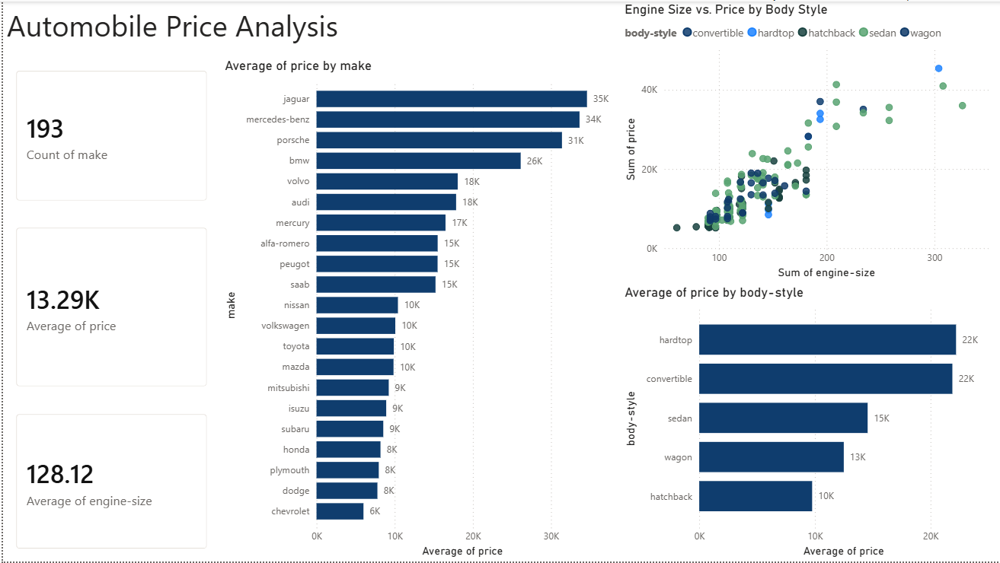

# Automobile Price Analysis

Data cleaning and exploratory analysis in Python, visualized as an interactive Power BI dashboard.

**Dataset:** UCI Automobile Dataset (1985 Ward's Automotive Yearbook) — 205 vehicles, 26 technical/spec variables, price as the target of analysis

**Tools:** Python (pandas, seaborn, matplotlib), Power BI (DAX, Power Query)

---

## Dashboard Preview

---

## Data Cleaning

- Six columns (`normalized-losses`, `num-of-doors`, `bore`, `stroke`, `horsepower`, `peak-rpm`, `price`) contained missing values disguised as the string `"?"` instead of true nulls.
- `normalized-losses` was missing in 41 of 205 rows (~20%) — too many to safely drop or impute without introducing bias, so the column was **dropped entirely** since it's an insurance risk-adjustment figure tangential to the price/spec analysis.
- The remaining five columns had only 2–4 missing values each — those rows were dropped, taking the dataset from 205 → 193 rows.
- Explicitly converted `bore`, `stroke`, `horsepower`, `peak-rpm`, and `price` to numeric type using `pd.to_numeric()`, since pandas keeps a column as text once it has seen any non-numeric value.

## Outlier Detection

Used the IQR method on `price`, `horsepower`, and `engine-size`. Rather than removing outliers by default, each was cross-checked against the car's `make`:

| Column | Outliers | Finding |
|---|---|---|
| `price` | 14 | Every single outlier belonged to one of four brands: BMW, Jaguar, Mercedes-Benz, or Porsche |
| `horsepower` | 5+ | Mostly the same luxury brands, with one exception — a Nissan at 200hp priced at only $19,699 |
| `engine-size` | Multiple | Again concentrated among the same four luxury/performance brands |

**Decision:** all outliers were retained — they represent genuine premium/performance vehicles, not data errors.

## Key Findings

1. **Size and power drive price, as a single underlying factor** — `engine-size` (r = 0.89), `curb-weight` (r = 0.84), and `horsepower` (r = 0.81) are the strongest price correlates, but they're also highly correlated *with each other* (0.82–0.88) — meaning they largely represent one underlying "size/power" dimension rather than five independent drivers.
2. **A distinct luxury tier exists** — Jaguar ($34,600), Mercedes-Benz ($33,647), Porsche ($31,401), and BMW ($26,119) average roughly double the mid tier and up to 6x the cheapest brand average (Chevrolet, $6,007).
3. **Body style carries a real, quantifiable premium** — hardtops ($22,209) and convertibles ($21,891) average roughly 2.3x the price of hatchbacks ($9,764), independent of brand.
4. **The price-size relationship is general, not brand-specific** — confirmed visually across every body style via scatter plot; sedans span the widest price range in the dataset, from the cheapest to among the most expensive vehicles.

## Dashboard Components

- **KPI Cards:** Total Cars (193), Average Price ($13,290), Average Engine Size (128.12)
- **Average Price by Make** — bar chart confirming the luxury brand premium tier
- **Average Price by Body Style** — bar chart confirming the hardtop/convertible premium
- **Engine Size vs. Price Scatter (by Body Style)** — interactive recreation of the Python scatter plot; required adding an Index column in Power Query to fix a default-aggregation bug that was collapsing 193 individual cars into just 5 category-level points

## Files in this Repo

- `automobile-price-analysis.ipynb` — full Python cleaning + EDA notebook
- `automobile_cleaned.csv` — cleaned dataset
- `Automobile Price Analysis.pbix` — Power BI dashboard file
- `Automobile_dashboard_screenshot.png` — dashboard preview image

##  What This Project Demonstrates

A complete, realistic data analyst workflow: reasoning through a real missing-data tradeoff (drop vs. impute a 20%-missing column), verifying outliers against a categorical explanation before deciding to retain them, distinguishing correlation from multicollinearity rather than overstating correlated variables as independent drivers, and diagnosing and resolving a genuine Power BI aggregation bug during dashboard construction.
